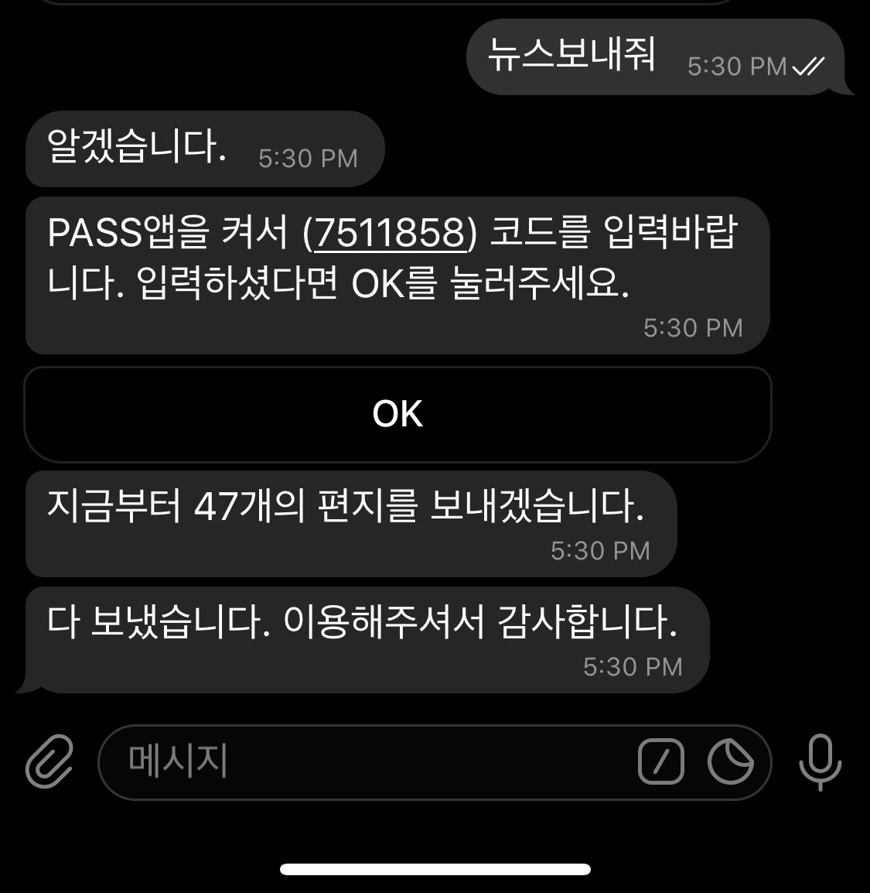

# 훈련소실검뉴스봇
육군훈련소에 가 있는 불쌍한 친구를 위해 매일 뉴스를 보내주자

## 소개



https://medium.com/@minukang/%EC%9C%A1%EA%B5%B0%ED%9B%88%EB%A0%A8%EC%86%8C-%EC%8B%A4%EC%8B%9C%EA%B0%84-%EA%B2%80%EC%83%89%EC%96%B4-%EB%89%B4%EC%8A%A4-%EC%A0%84%EC%86%A1-%EB%B4%87-%EA%B0%9C%EB%B0%9C%ED%9B%84%EA%B8%B0-f0c178a4e4dc

## 설정

```bash
git clone https://github.com/minuukang/army-letter-bot
cd army-letter-bot
npm ci
cp .env.example .env
npm start
```

`.env.example` 파일을 `.env` 로 복사하여 알맞는 설정값을 입력하세요.

```
ARMY_IN_DATE=20200716 # 육군훈련소 들어간 날짜
ARMY_BIRTH_DATE=000000 # 훈련병 생년월일
ARMY_NAME=홍길동 # 훈련병 생일
PASS_AUTH_AGENCY=SKT|KTF|LGT|MVNO # 본인 통신사 (MVNO는 알뜰폰)
LETTER_PASSWORD=1234 # 편지 작성 비밀번호
TELEGRAM_TOKEN=my_telegram_token # 텔레그램 토큰
```
